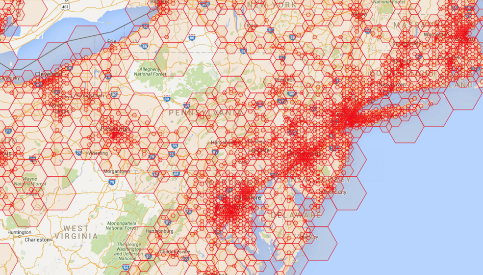

# Hexagonal geo-coding system

Covering the world with hexagons on several zoom levels:
    

Based on the [GeoHex library](http://www.geohex.org/) by [Tadayasu Sasada](https://twitter.com/sa2da).

## How to use

To add the library as an npm dependency to your project, run:

    npm install --save ilyabo/geohex.js#3.0.4
    

Then:

    var geohex = require('geohex')
    
    
## Methods

 
### getZoneByLocation(lat, lon, level)

Get the hexagon zone object for a specific location and zoom level: 
    
    
    var zone0 = geohex.getZoneByLocation(33.35, 135.61, 0)
    // zone0.code equals to 'XM'
    
    var zone1 = geohex.getZoneByLocation(33.35, 135.61, 1)
    // zone1.code equals to 'XM4'
          
    var zone2 = geohex.getZoneByLocation(33.35, 135.61, 2)
    // zone2.code equals to 'XM42'
      
    var zone3 = geohex.getZoneByLocation(33.35, 135.61, 3)
    // zone3.code equals to 'XM428'
  
  
### getZoneByCode(code)  

Get the hexagon zone object by it's code:
        
    var zone = geohex.getZoneByCode('XM428')
        
        
## Zone props and methods
        
### zone.code

The string code of the hexagon.

### zone.lat, zone.lon

The geographic coordinates of the center of the hexagon.

### zone.x, zone.y

The coordinates of the hexagon in the hexagonal grid.

### zone.getHexCoords()
       
Returns the coords of the hexagon vertices:
        
    var coords = geohex.getZoneByCode('XM428').getHexCoords()
