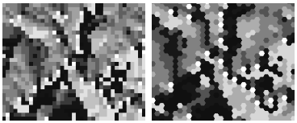

# Hexagonal geo-coding system

Covering the world in the Mercator projection with nested hexagons on multiple zoom levels:
    

Based on the [GeoHex library](http://www.geohex.org/) by [Tadayasu Sasada](https://twitter.com/sa2da).

This is a sister library for [this Scala version](https://github.com/teralytics/geohex).

## Why hexagons?

There are several advantages hexagonal grids may have over quadratic ones for data visualization, most importantly: 

  * better sampling efficiency
  * better perception (visually less biased).

>  Why hexagons? There are many reasons for using hexagons, at least over squares. Hexagons have symmetry of nearest neighbors which is lacking in square bins. Hexagons are the maximum number of sides a polygon can have for a regular tesselation of the plane, so in terms of packing a hexagon is 13% more efficient for covering the plane than squares. This property translates into better sampling efficiency at least for elliptical shapes. Lastly hexagons are visually less biased for displaying densities than other regular tesselations. For instance with squares our eyes are drawn to the horizontal and vertical lines of the grid.

https://cran.r-project.org/web/packages/hexbin/vignettes/hexagon_binning.pdf

>    The data model of quadratic cells can cause problems of direction bias or dependence in certain raster analyses that consist of computing new parameters based on a raster cell neighbourhood.
>    ...
>    Hexagon depictions can help to disperse the perception of privileged directions in field model data.
    
http://www.ralphstraumann.ch/blog/2013/10/hexagons-quasi-maps-and-cartograms/

### Squares vs hexagons

## How to use

Add this to your HTML file:

    

Then, you call use the library methods like this: 

    

## Usage as an NPM module
To add the library as an npm dependency to your project, run:

    npm install --save ilyabo/geohex.js#3.0.7
    

Then:

    var geohex = require('geohex')
    
    
## Methods

 
### getZoneByLocation(lat, lon, level)

Get the hexagon zone object for a specific location and zoom level: 
    
    
    var zone0 = geohex.getZoneByLocation(33.35, 135.61, 0)
    // zone0.code equals to 'XM'
    
    var zone1 = geohex.getZoneByLocation(33.35, 135.61, 1)
    // zone1.code equals to 'XM4'
          
    var zone2 = geohex.getZoneByLocation(33.35, 135.61, 2)
    // zone2.code equals to 'XM42'
      
    var zone3 = geohex.getZoneByLocation(33.35, 135.61, 3)
    // zone3.code equals to 'XM428'
  
  
### getZoneByCode(code)  

Get the hexagon zone object by it's code:
        
    var zone = geohex.getZoneByCode('XM428')
     
### getZonesWithin(bbox, level)  

Get all hexagons of the given `level` falling into the `bbox`.  
        
    var zones = geohex.getZonesWithin([[-125, 24], [-64, 49]], 2);

        
        
## Zone props and methods
        
### zone.code

The string code of the hexagon.

### zone.centroid

The geographic coordinates of the center of the hexagon.

### zone.getInnerRadius()

Returns the outer radius of the hexagon in meters.

### zone.getOuterRadius()

Returns the outer radius of the hexagon in meters.

### zone.getCoords()
       
Returns the coords of the hexagon vertices (array of [lon, lat] arrays):
        
    var coords = geohex.getZoneByCode('XM428').getHexCoords()

### zone.getPolygon()
       
Returns the GeoJSON polygon geometry for the hexagon.
        
    var coords = geohex.getZoneByCode('XM428').getPolygon()
    

### zone.getWKT()
       
Returns the [well-known text](https://en.wikipedia.org/wiki/Well-known_text) polygon geometry for the hexagon.
        
    var coords = geohex.getZoneByCode('XM428').getWellKnownText()
    
    
    

# LICENSE

The MIT License (MIT)

Copyright (c) 2010 [Tadayasu Sasada](http://geohex.org)

Copyright (c) 2015 [Ilya Boyandin](https://github.com/ilyabo)

Permission is hereby granted, free of charge, to any person obtaining a copy
of this software and associated documentation files (the "Software"), to deal
in the Software without restriction, including without limitation the rights
to use, copy, modify, merge, publish, distribute, sublicense, and/or sell
copies of the Software, and to permit persons to whom the Software is
furnished to do so, subject to the following conditions:

The above copyright notice and this permission notice shall be included in
all copies or substantial portions of the Software.

THE SOFTWARE IS PROVIDED "AS IS", WITHOUT WARRANTY OF ANY KIND, EXPRESS OR
IMPLIED, INCLUDING BUT NOT LIMITED TO THE WARRANTIES OF MERCHANTABILITY,
FITNESS FOR A PARTICULAR PURPOSE AND NONINFRINGEMENT.  IN NO EVENT SHALL THE
AUTHORS OR COPYRIGHT HOLDERS BE LIABLE FOR ANY CLAIM, DAMAGES OR OTHER
LIABILITY, WHETHER IN AN ACTION OF CONTRACT, TORT OR OTHERWISE, ARISING FROM,
OUT OF OR IN CONNECTION WITH THE SOFTWARE OR THE USE OR OTHER DEALINGS IN
THE SOFTWARE.